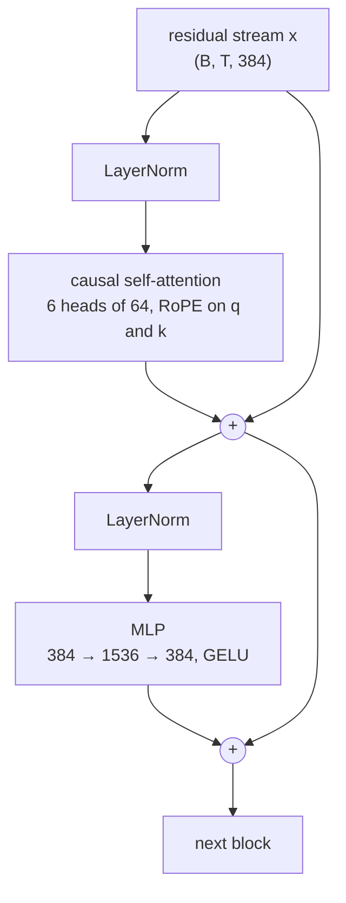
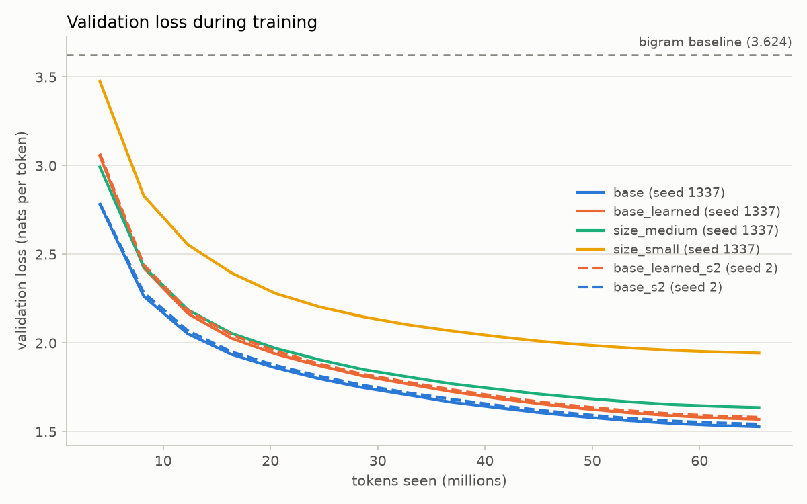
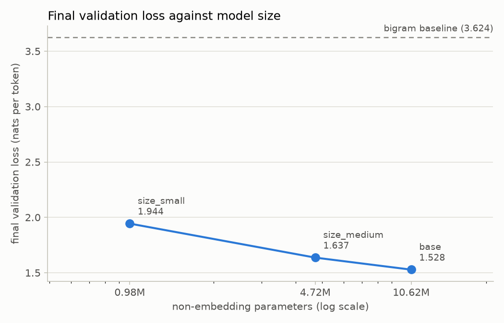
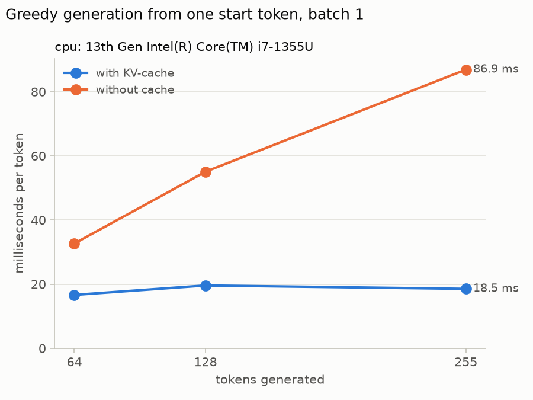

# Ligature

Ligature is a GPT-style language model that I wrote from scratch in PyTorch and trained on TinyStories: my own byte-level BPE tokeniser, the transformer, the training loop, a KV-cache for generation, controlled experiments, tests, CI and a small Dockerised API. The name comes from typographic ligatures, where a pair of letters such as f and i is fused into a single glyph; a BPE tokeniser builds its vocabulary the same way, by repeatedly fusing the most frequent pair of symbols into one.

## Architecture

The model is a decoder-only transformer with pre-LayerNorm blocks, rotary position embeddings and an LM head that shares its weights with the token embedding. Every block looks like this, shown with the base model's dimensions:



| | base |
|---|---:|
| Layers | 6 |
| Attention heads | 6 |
| Model width (`d_model`) | 384 |
| Head size | 64 |
| MLP hidden size | 1536 |
| Context (`block_size`) | 256 |
| Vocabulary | 4096 |
| Non-embedding parameters | 10,621,824 |

I quote model sizes as non-embedding parameters, as Kaplan et al. (2020) do, so that the size sweep compares the parts of the model that actually change. Counting the tied token embedding as well, the base model has 12,194,688 parameters in total.

Every component is written by hand in `src/ligature/model.py`. `F.scaled_dot_product_attention` is used only behind a `use_sdpa` flag, next to the explicit implementation it is tested against.

## Data and tokeniser

The training text is the first 300 MB of `TinyStoriesV2-GPT4-train.txt`, and the validation text is the whole of `TinyStoriesV2-GPT4-valid.txt`, both from the `roneneldan/TinyStories` dataset on Hugging Face. Stories are separated by an `<|endoftext|>` token.

| | |
|---|---:|
| Training stories | 384,130 |
| Training tokens | 78,064,554 |
| Validation stories | 27,630 |
| Validation tokens | 5,580,897 |
| Vocabulary size | 4096 |
| Text used to train the tokeniser | 20.0 MB |
| Tokeniser training time | 3.77 s |
| Validation bytes per token | 3.9755 |

The tokeniser is a byte-level BPE in `src/ligature/tokenizer.py`. It splits text with the GPT-2 pre-tokenisation regex, so merges never cross word or punctuation boundaries, and it trains on a table of chunk frequencies, updating only the chunks a merge touches. `<|endoftext|>` is a special token that is never split. The figures above come from `results/data_stats.json`.

## Results

Every run saw the same 65,536,000 tokens: 4,000 steps of 64 sequences of 256 tokens, from the same data, with AdamW (β = 0.9, 0.95; weight decay 0.1), a linear warmup over 200 steps to a learning rate of 0.001 and cosine decay to 0.0001. They ran on a Tesla T4 in fp16 with PyTorch 2.11.0+cu128. Losses are mean cross-entropy in nats per token on the validation split.

| Run | Positions | Seed | Non-embedding params | Tokens seen | Final val loss | Final val perplexity | Training time |
|---|---|---|---:|---:|---:|---:|---:|
| base | rope | 1337 | 10,621,824 | 65,536,000 | 1.5281 | 4.61 | 11.6 min |
| base_learned | learned | 1337 | 10,621,824 | 65,536,000 | 1.5702 | 4.81 | 9.0 min |
| size_medium | rope | 1337 | 4,721,920 | 65,536,000 | 1.6366 | 5.14 | 7.2 min |
| size_small | rope | 1337 | 984,448 | 65,536,000 | 1.9438 | 6.99 | 3.7 min |
| base_learned_s2 | learned | 2 | 10,621,824 | 65,536,000 | 1.5819 | 4.86 | 9.2 min |
| base_s2 | rope | 2 | 10,621,824 | 65,536,000 | 1.5428 | 4.68 | 11.5 min |
| bigram baseline | - | - | - | 78,064,554 | 3.6243 | 37.50 | - |



The bigram baseline counts which token follows which in the training data, with add-one smoothing. It reaches a validation loss of 3.6243 (perplexity 37.50), so everything below that line comes from using context.



The size sweep keeps the data and the number of tokens fixed and changes only the width and depth: 0.98M non-embedding parameters reach 1.9438, 4.72M non-embedding parameters reach 1.6366, 10.62M non-embedding parameters reach 1.5281.

Rotary position embeddings beat learned position embeddings at both seeds. The gap is the learned run's final validation loss minus the RoPE run's:

- Seed 1337: 1.5702 (learned) minus 1.5281 (RoPE) = +0.0421
- Seed 2: 1.5819 (learned) minus 1.5428 (RoPE) = +0.0391

Both gaps point the same way, but two seeds are not enough to put an error bar on them. My RoPE runs were also slower per step, as the training-time column shows: my implementation splits every head into channel pairs and stacks them back together, which costs extra memory traffic.

The table and both plots are written by `scripts/plot_results.py` from `results/runs/*/` and `results/bigram.json`.

## Samples

Three stories from `runs/base/ckpt.pt`, sampled on CPU with temperature 0.8, top-k 50 and seed 1337:

```
python -m ligature.generate --ckpt runs/base/ckpt.pt --prompt "Once upon a time" --n 3 --temperature 0.8 --top-k 50 --seed 1337 --max-new-tokens 250
```

**Sample 1**

> Once upon a time, in a small house, there was a little girl named Mia. She had a small, soft pillow that she liked to sit in. One day, Mia's pillow fell from her hand and let her sit too. She was so happy, but she was also impatient.
>
> Mia's mom came into the room and saw her playing with her pillow. "Mia, don't forget to put your pillow away," said Mom. "Now it's safe and dry." Mia smiled and picked up her pillow. She put it in the sun to dry, so it would be safe.
>
> Mia took her pillow outside to play. She played and played, taking her pillow with it. Then, Mia remembered the pillow in the sun. She took it out and gave it a hug. She was ready to keep her pillow safe with her real pillow. From that day on, Mia and her pillow were the best of friends.

**Sample 2**

> Once upon a time, in a small town, there was a little girl named Lily. She had a doll named Daisy. Lily loved Daisy very much. They played together every day. One day, Lily and Daisy went to the park.
>
> At the park, Lily and Daisy saw a big tree. Lily said, "Daisy, I will use your doll to make it pretty!" Daisy replied, "Thank you, Lily!" They played in the park until the sun went down. Lily and Daisy went home with a big smile on their faces.
>
> When Lily's mom came back home, she saw Daisy and Daisy. She was very happy to see them. Lily said, "Thank you, Daisy!" Daisy smiled and said, "You're welcome! Come play again soon!" Lily, Daisy, and Daisy played together at the park, and Lily made a new friend.

**Sample 3**

> Once upon a time, there was a little girl who loved playing in her backyard. She was playing with her toys when suddenly she felt an itch on her arm. She looked around to see if her mom would come over and take it from the house.
>
> “It’s too hard to get out!” she cried.
>
> Her mom nodded and said, “Well, it’s time to go inside and get some warm water.”
>
> So, the little girl grabbed the water and started digging under her bed. After a while, she was all drinking and feeling happy!
>
> “Mommy, I have a surprise,” she said.
>
> Her mom smiled, “Thank you for the help. Now, let’s go and see what we can find.”
>
> And so, the little girl and her mom went off to find some special leaves. They looked for more leaves to eat, but they couldn’t see any.
>
> The little girl was so sad that she started to cry. Even though the day was over, she didn't get to play with the leaves.

They are not cherry-picked: these are the three samples that command produced. Sampling depends on the device as well as the seed, so the same command on a GPU gives different stories.

## KV-cache

During generation each new token needs the keys and values of every earlier position. Without a cache the model recomputes them all at every step; with one it computes them once and stores them, so each step only processes the newest token. `scripts/benchmark_kv_cache.py` times greedy generation from a single `<|endoftext|>` token at batch size 1 on a 13th Gen Intel(R) Core(TM) i7-1355U with 10 threads, taking the median of five runs after three warm-up runs.

| Tokens generated | With cache | Without cache | Speed-up |
|---:|---:|---:|---:|
| 64 | 16.652 ms/token (60.1 tok/s) | 32.656 ms/token (30.6 tok/s) | 2.0x |
| 128 | 19.585 ms/token (51.1 tok/s) | 55.065 ms/token (18.2 tok/s) | 2.8x |
| 255 | 18.534 ms/token (54.0 tok/s) | 86.884 ms/token (11.5 tok/s) | 4.7x |



Without the cache the cost per token grows with the length of the sequence; with it the cost stays nearly flat. On a CPU at batch size 1 the cached cost is dominated by fixed work per step, such as the LM head and launching each layer's operations, which is why the speed-up grows with length rather than being large from the start. For the base model the cache holds 4.5 MiB per sequence in fp32.

## Reproduce

Install PyTorch for your machine first (the CPU build is shown), then the package:

```
python -m pip install torch --index-url https://download.pytorch.org/whl/cpu
python -m pip install -e ".[dev,serve]"
```

Prepare the data. The first command downloads TinyStories, trains the tokeniser and writes `data/train.bin`, `data/val.bin`, `data/tokenizer.json` and `results/data_stats.json`. The second uses only the small validation file, split 90/10, which is enough to try everything on a laptop:

```
python scripts/prepare_data.py
python scripts/prepare_data.py --local --vocab-size 1024
```

Train. `configs/tiny.yaml` is a smoke test that runs on CPU in under a minute; the others need a GPU:

```
python -m ligature.train --config configs/tiny.yaml --out runs/tiny
python -m ligature.train --config configs/base.yaml --out runs/base
python -m ligature.train --config configs/base_learned.yaml --out runs/base_learned
python -m ligature.train --config configs/size_small.yaml --out runs/size_small
python -m ligature.train --config configs/size_medium.yaml --out runs/size_medium
python -m ligature.train --config configs/base.yaml --out runs/base_s2 --seed 2
python -m ligature.train --config configs/base_learned.yaml --out runs/base_learned_s2 --seed 2
```

Any config field can be overridden as `--key value`, and `--resume` continues a run from its checkpoint. I ran all of these on Kaggle with `notebooks/kaggle_train.ipynb`, which also works on Colab. It prepares the data, runs the bigram baseline, trains the runs in pairs on two GPUs and packs the results into a zip that unpacks at the repo root.

Baseline, plots and benchmark. `plot_results.py` reads `log.csv`, `config.yaml` and `run_info.yaml` from `results/runs/<name>/`, so copy those three files there from each `runs/<name>/` first:

```
python scripts/bigram_baseline.py
python scripts/plot_results.py
python scripts/benchmark_kv_cache.py
```

Generate, test and serve:

```
python -m ligature.generate --ckpt runs/base/ckpt.pt --prompt "Once upon a time" --n 3
pytest
docker build -t ligature .
docker run --rm -p 7860:7860 -v "$PWD/runs/base:/home/user/app/model:ro" -e MODEL_DIR=model ligature
```

The app is then at http://localhost:7860: a page with a text box, plus `POST /generate` and `GET /health`. Without Docker, `MODEL_DIR=runs/base uvicorn app.main:app --port 7860` does the same.

## Tests and CI

[](https://github.com/kshubham-108/ligature/actions/workflows/ci.yml)

The suite runs on CPU without downloading anything:

- Tokeniser: exact round trips on ASCII, accented text, emoji and the empty string; `<|endoftext|>` encodes to one id; training is deterministic; the first three merges on a small corpus match a count done by hand; the vocabulary size is respected.
- Model: output shapes; the loss at initialisation is close to ln(vocabulary size); changing a token never changes the logits at earlier positions; the explicit attention path matches SDPA; the RoPE score depends only on the relative offset; the LM head shares storage with the token embedding; the parameter count matches a closed form; a tiny model overfits one batch.
- Training: learning-rate values at the key steps; saving and loading a checkpoint gives identical logits; `configs/tiny.yaml` trains and its loss falls, with the final step always evaluated and checkpointed.
- Generation: greedy output with the KV-cache equals greedy output without it, token for token, for both position encodings and both attention paths; cached logits match a full forward pass; the cache never grows past `block_size`; top-k never samples outside the top k.
- API: health, the HTML page, generation, the `max_new_tokens` cap and request validation, against a tiny random model.

GitHub Actions runs `ruff check`, `ruff format --check` and `pytest` on Python 3.11 with CPU-only PyTorch on every push and pull request, and a separate job builds the Docker image.

## Design decisions

**Byte-level BPE with 4096 tokens.** Starting from the 256 byte values means any text can be encoded, with no unknown token. TinyStories uses a small, simple vocabulary, so a small BPE vocabulary already gives 3.9755 bytes per token on the validation set, and it keeps the embedding matrix from dominating the smallest models.

**Pre-norm blocks.** I put LayerNorm before attention and before the MLP, inside each residual branch, so the residual stream itself is a plain sum from the embedding to the final LayerNorm. Gradients reach early layers through that sum unchanged, which is why pre-norm stacks train more stably than the original post-norm design.

**Rotary position embeddings.** RoPE rotates each query and key by an angle that depends on its position, so the attention score between two tokens depends only on how far apart they are. It adds no parameters, and on these runs it gave a lower validation loss than learned position embeddings at both seeds.

**Weight tying.** The LM head reuses the token embedding matrix, which saves 1,572,864 parameters and tends to help small models: the same vector both reads a token in and predicts it out.

**No weight decay on norms, biases and embeddings.** Weight decay pulls weights towards zero. That is a useful regulariser for the 2-D weight matrices, but for a LayerNorm gain it would shrink the scale of the whole layer, and for an embedding it would keep eroding rare tokens that seldom receive a gradient. AdamW therefore decays only the 2-D weight matrices.

**An explicit attention path checked against SDPA.** I wrote attention out by hand (scores, causal mask, softmax, weighted sum) so that I could read and test every step. A test checks it against PyTorch's fused `scaled_dot_product_attention`, with and without the KV-cache; once they agreed, I used SDPA for the GPU runs because it is faster.

**Fixed evaluation batches.** Every evaluation draws the same 50 batches from each split, by re-seeding its own random generator. Curves are then smooth, and runs are compared on exactly the same text. The cost is that each estimate uses a fixed sample of 819,200 validation tokens rather than the whole split.

## Limitations

- The base comparison uses two seeds and the size sweep only one, so I cannot put error bars on the differences.
- Every size uses the same hyperparameters, chosen for the base model. The smaller models might do better with a higher learning rate, so the size sweep is not a tuned scaling law.
- Compute was small: free Kaggle GPUs and 65,536,000 tokens per run.
- The context is 256 tokens, which is enough for a short story but too short to show where RoPE's relative positions matter most.
- The model only knows TinyStories. It writes simple children's stories and nothing else.
- There is no instruction tuning: it continues text rather than following requests.

## References

- Vaswani et al. (2017), [Attention Is All You Need](https://arxiv.org/abs/1706.03762).
- Su et al. (2021), [RoFormer: Enhanced Transformer with Rotary Position Embedding](https://arxiv.org/abs/2104.09864).
- Eldan and Li (2023), [TinyStories: How Small Can Language Models Be and Still Speak Coherent English?](https://arxiv.org/abs/2305.07759)
- Kaplan et al. (2020), [Scaling Laws for Neural Language Models](https://arxiv.org/abs/2001.08361), for counting non-embedding parameters.
- Andrej Karpathy, [nanoGPT](https://github.com/karpathy/nanoGPT) and the tokeniser lecture [Let's build the GPT Tokenizer](https://www.youtube.com/watch?v=zduSFxRajkE), with its code in [minbpe](https://github.com/karpathy/minbpe).

## What I learned

Most of my recent projects build agents on top of language models, and I wanted to understand what actually happens inside one. Writing single-head attention by hand in a notebook, before touching the real model, was the step that made everything after it make sense. Once I had printed the shape of every tensor and watched the causal mask hide the future from each position, multi-head attention stopped feeling like a black box.

The tests taught me as much as the code. Seeing an untrained model start at a loss of almost exactly ln(vocabulary size) told me the initialisation was right before a single training step. Checking my explicit attention against PyTorch's fused kernel gave me the confidence to use the faster version for the real runs. The experiments taught me something similar about fairness: a comparison only means something when everything except the one thing being tested is held fixed, including the data, the seed and the number of tokens seen.

With more compute, I would train for longer, repeat each experiment over more seeds, and extend the context beyond 256 tokens to see where rotary position embeddings really earn their place.
